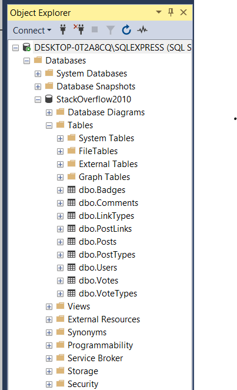
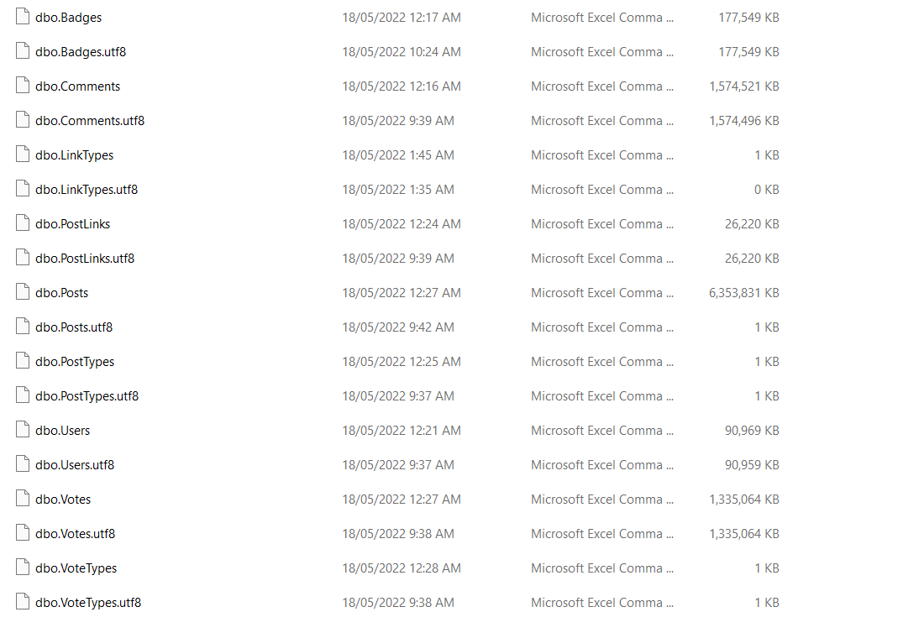
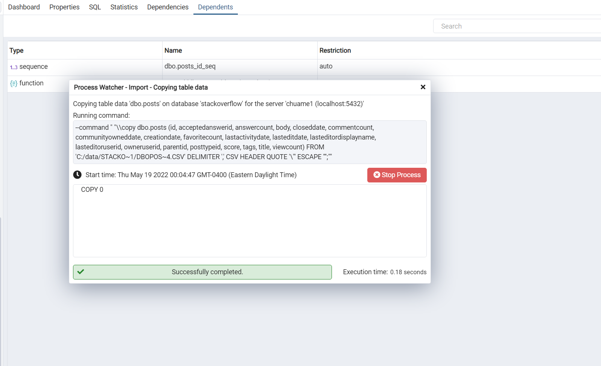
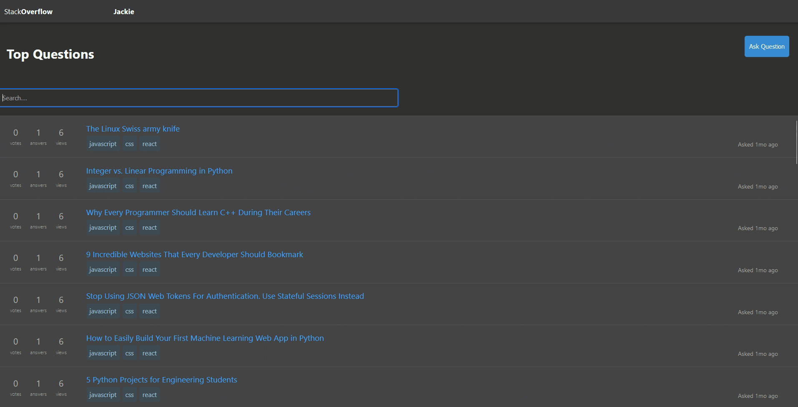

# StackOverflow Clone

## Task 1 - Partially Done


### Prepare the database

1. Converted MDF file to csv using SQL server



2. Migrated csv under UTF-16 to UTF-8



3. Migrated csv to postgreSQL database using pgAdmin



**Issues**

Cannot migrate data into **postgreSQL** to prepare for webapp backend

**Solution**

Used alternative API to begin the fronend
    

### Building React App Functions


**Questions.js**


1.Fetching API using useEffect Hook

```js
  useEffect(() => {
    axios.get(`API route here`)
      .then((response) => {
        console.log(response.data);
        setAPIData(response.data);
      })
  }, [])

```

1. Creating a function for searching article/question

```js
const searchItems = (searchValue) => {
    setSearchInput(searchValue)
    if (searchInput !== '') {
      const filteredData = APIData.filter((item) => {
        return Object.values(item).join('').toLowerCase().includes(searchInput.toLowerCase())
      })
      setFilteredResults(filteredData)
    }
    else {
      setFilteredResults(APIData)
    }
  }
```

3. Input Component

```js
      <input placeholder='Search...'
        onChange={(e) => searchItems(e.target.value)}
      />
```

4. Mapping data array and return results

- Show everything if there is no input

```js
          APIData.map((item) => {
            return (
              <div className='questionrow' id={item.id}>
                <div className='questionstats'>0<span>votes</span></div>
                <div className='questionstats'>1<span>answers</span></div>
                <div className='questionstats'>6<span>views</span></div>


                <div className='questiontitle'>
                  <div className='questionlink'><a href={item.url}>{item.title}</a></div>
                  {/* <p className='questionbody'>{item.body.slice(0, 140)}...</p> */}
                  <div className='tags'>javascript</div>
                  <div className='tags'>css</div>
                  <div className='tags'>react</div>
                  <div className='whoandwhen'>
                    Asked {item.ago} ago
                    {/* <Link to="/">Jackie</Link> */}
                  </div>
                </div>
              </div>
            )
          })
```

- Show the result when we have some input

```js
searchInput.length > 1 && (
          filteredResults.map((item) => {
            return (
              <>
                <div className='questionrow' id={item.id}>
                  <div className='questionstats'>0<span>votes</span></div>
                  <div className='questionstats'>1<span>answers</span></div>
                  <div className='questionstats'>6<span>views</span></div>
                  <div className='questiontitle'>
                    <div className='questionlink'><a href={item.url}>{item.title}</a></div>
                    {/* <p className='questionbody'>{item.body.slice(0, 140)}...</p> */}
                    <div className='tags'>javascript</div>
                    <div className='tags'>css</div>
                    <div className='tags'>react</div>
                    <div className='whoandwhen'>
                      Asked {item.ago} ago
                      {/* <Link to="/">Jackie</Link> */}
                    </div>
                  </div>
                </div>
              </>
            )
          }))
```


### `npm start`

Runs the app in the development mode.\
Open [http://localhost:3000](http://localhost:3000) to view it in your browser.

The page will reload when you make changes.\
You may also see any lint errors in the console.


## Task 2 -- Done

``` sql
SELECT
    CASE WHEN PostTypeId = 1 THEN 'Question' ELSE 'Answer' END As [Post Type],
    DATENAME(WEEKDAY, p.CreationDate) AS Day,
    Count(*) AS Amount,
    SUM(CASE WHEN VoteTypeId = 2 THEN 1 ELSE 0 END) AS UpVotes,
    SUM(CASE WHEN VoteTypeId = 3 THEN 1 ELSE 0 END) AS DownVotes,
    CASE WHEN SUM(CASE WHEN VoteTypeId = 3 THEN 1 ELSE 0 END) = 0 THEN NULL
     ELSE (CAST(SUM(CASE WHEN VoteTypeId = 2 THEN 1 ELSE 0 END) AS float) / CAST(SUM(CASE WHEN VoteTypeId = 3 THEN 1 ELSE 0 END) AS float))
    END AS UpVoteDownVoteRatio
FROM
    Votes v JOIN Posts p ON v.PostId=p.Id
WHERE
    PostTypeId In (1,2)
 AND
    VoteTypeId In (2,3)
GROUP BY
    PostTypeId, DATEPART(WEEKDAY, p.CreationDate), DATENAME(WEEKDAY, p.CreationDate)
ORDER BY
    UpVoteDownVoteRatio DESC
```

## Task 3 -- Partially done

``` sql
DECLARE @start datetime = DATEADD(day, -7*52*8, GETDATE());
DECLARE @stop  datetime = DATEADD(day, -2, GETDATE());

SELECT
  DATEADD(week, datediff(week, @start, p.CreationDate), @start) as [Week],
  SUM(CASE WHEN p.PostTypeId = 1 THEN 1 ELSE 0 END) AS [Questions],
  SUM(CASE WHEN p.PostTypeId = 2 THEN 1 ELSE 0 END) AS [Answers],
  CASE WHEN SUM(CASE WHEN VoteTypeId = 3 THEN 1 ELSE 0 END) = 0 THEN NULL
     ELSE (CAST(SUM(CASE WHEN VoteTypeId = 2 THEN 1 ELSE 0 END) AS float)
  + CAST(SUM(CASE WHEN VoteTypeId = 3 THEN 1 ELSE 0 END) AS float)) AS [Votes]
FROM
    Votes v JOIN Posts p ON v.PostId=p.Id
WHERE
  PostTypeId In (1,2)
 AND
    VoteTypeId In (2,3)
  and p.CreationDate >= @start and p.CreationDate < @stop
GROUP BY
  dateadd(week, datediff(week, @start, p.CreationDate), @start)
ORDER BY
  dateadd(week, datediff(week, @start, p.CreationDate), @start)
    ```
```

